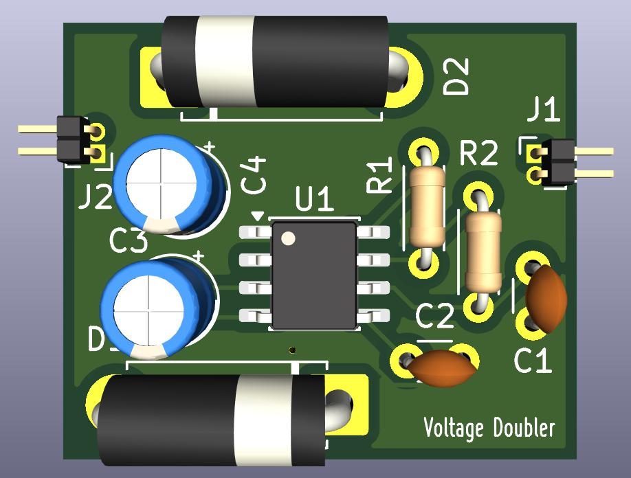
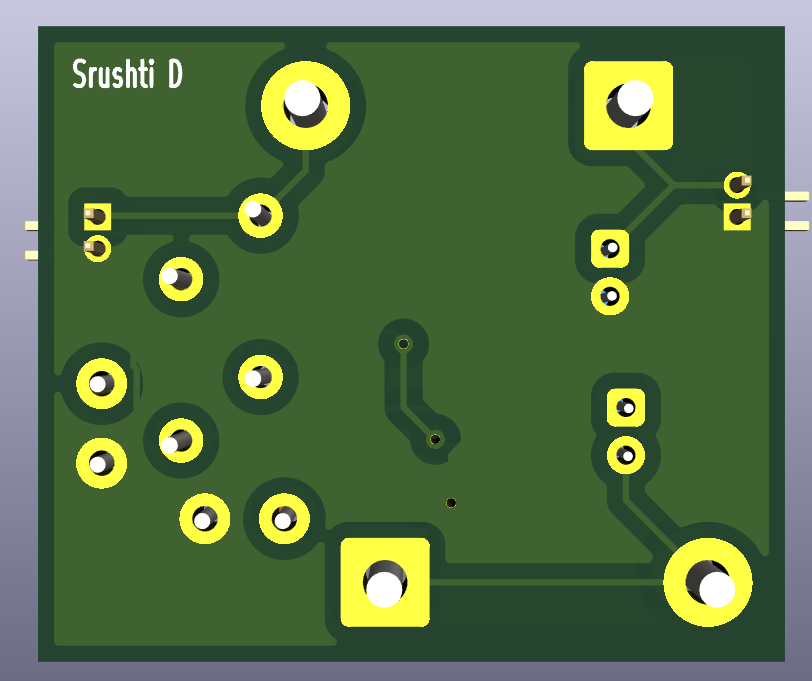
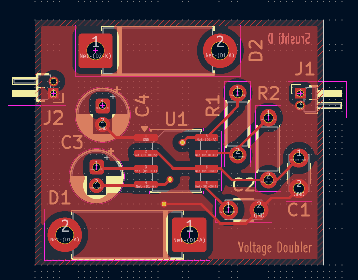
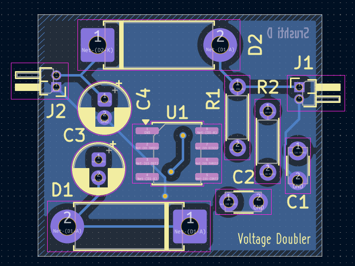
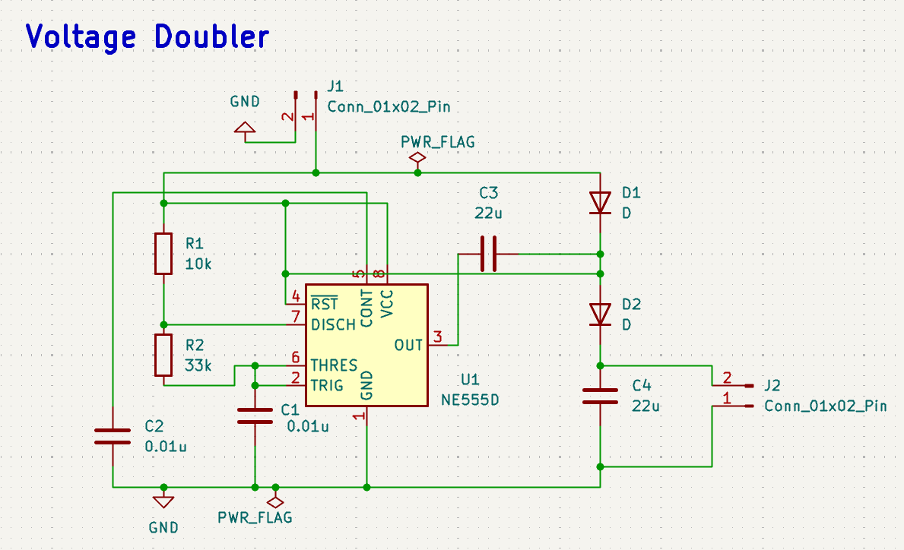

# NE555 Voltage Doubler – KiCad PCB Design

This project is a compact 2-layer voltage doubler PCB designed in KiCad 10 around an NE555D timer-based circuit. The project was developed to gain hands-on experience with the complete PCB design workflow, from creating the circuit schematic and selecting component footprints to designing the physical board layout, routing the PCB, and reviewing the final design in 3D.

The circuit consists of an NE555D timer, resistors, capacitors, and diodes arranged to implement the voltage-doubling stage. The design also includes dedicated 2-pin input and output connectors. Through-hole components were used throughout the board, with the component placement arranged to keep the PCB compact and the connections clearly organized.

The PCB was designed as a 2-layer board, using both copper layers for routing and incorporating copper-filled areas into the layout. Particular attention was given to component positioning, trace routing, silkscreen references, connector placement, and overall board organization. The final PCB was then visualized using KiCad's 3D Viewer to inspect the physical appearance and component arrangement of the design.

The project provided practical experience in taking a circuit from a schematic representation to a complete PCB layout. It strengthened my understanding of schematic capture, footprint selection, through-hole PCB design, component placement, multi-layer routing, copper zones, silkscreen organization, and KiCad's 3D visualization workflow.

Overall, this project served as a practical exercise in PCB design and helped bridge the gap between circuit-level design and physical hardware implementation.

---
## Overview

This project is a PCB implementation of an NE555-based voltage doubler circuit.

The circuit uses an NE555D timer, resistors, capacitors, and diodes to implement the voltage-doubling circuit, with dedicated input and output connectors.

The PCB was designed as a hands-on exercise in taking a circuit from **schematic → PCB layout → routing → 3D visualization** using KiCad 10.

---
## Features

- NE555D-based voltage doubler circuit
- 2-layer PCB design
- Compact component placement
- Through-hole components
- Dedicated input and output connectors
- Front and back copper routing
- Copper-filled PCB areas
- Clearly labeled component references
- Organized silkscreen
- 3D PCB visualization
- Editable KiCad design files

---
## Software Used

- **KiCad 10**
  - Schematic Editor
  - PCB Editor
  - 3D Viewer

---
## PCB Design

The PCB was designed as a compact 2-layer board, with through-hole components arranged for a clean and organized layout.

### Front View

  

### Back View

  

---
## PCB Layout

The PCB layout includes component placement, routing across both copper layers, copper-filled areas, and organized silkscreen markings.

### Front Copper / Layout

  

### Back Copper / Layout

  

---
## Schematic

The schematic contains the NE555 timer section, timing components, diode-capacitor voltage doubler section, power connections, and input/output connectors.

  

---
## Learning Outcomes

This project helped strengthen my practical understanding of the **PCB design workflow using KiCad**, including:

- Schematic capture
- Component and footprint selection
- PCB component placement
- Through-hole PCB design
- 2-layer PCB routing
- Copper zone and fill handling
- Silkscreen organization
- PCB layout visualization
- Connecting schematic design with PCB implementation
- Managing KiCad schematic, PCB, and project files

The project provided hands-on experience in translating a circuit schematic into a physically organized PCB layout.

---
## Future Improvements

Possible improvements for future iterations include:

- Further optimization of component placement and routing
- Improving PCB compactness and layout organization
- Adding additional design considerations for practical fabrication
- Exploring alternative footprints and component packages
- Fabricating the PCB and performing hardware-level testing
- Comparing the practical output with the expected circuit behavior

---
## Author

**Srushti D**
[GitHub](https://github.com/Srushti-D-Hebbar)

---
## License

This project is licensed under the MIT License — see the [LICENSE](LICENSE) file for details.
